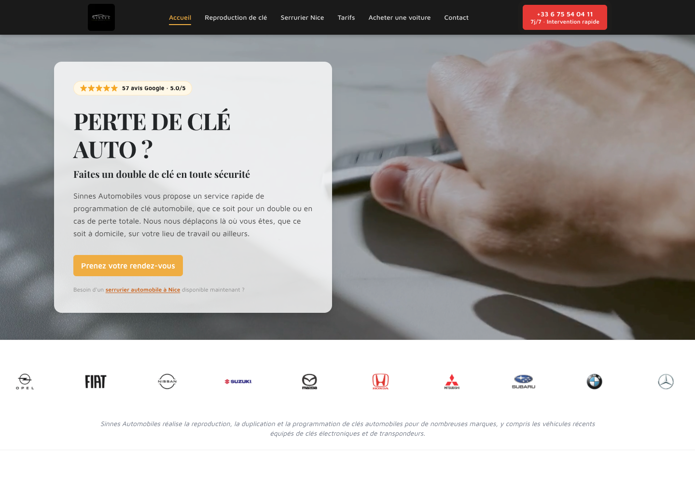

# Sinnes Automobiles

Site vitrine et pages de services locaux pour une activité de serrurerie automobile à Nice. Le projet explore Next.js16/React19, rendu statique, contenu SEO par service et marque, vidéo d’accueil, navigation responsive, Framer Motion et Swiper.



Le design existant est conservé. Les avis, tarifs, disponibilités et promesses commerciales visibles proviennent du contenu historique ; ils n’ont pas été revérifiés ici. Ce n’est ni un système de réservation ni une garantie de positionnement Google.

## Lancer

Node.js20.9+ compatible avec Next16 ; Node26.7.0 utilisé pour cette vérification, pas une validation de toutes les versions.

```sh
npm ci --ignore-scripts
npm run build
npm start -- --hostname 127.0.0.1 --port 4187
```

Ouvrir http://127.0.0.1:4187. En développement : `npm run dev`. Sources dans le dépôt privé existant, Code → Download ZIP avec accès autorisé. Aucun nouveau déploiement de production ni changement de visibilité.

## Vérifications

Build et TypeScript réussis,27pages générées dans le build dont les routes techniques. Les17tests Chromium existants passent sur le serveur local : titres, navigation/téléphone, vidéo hero, pages de services et certains textes. L’accueil à390px a une largeur de document390px ; vidéo en lecture et44images chargées. Trois captures réelles : accueil desktop/mobile et service.

```sh
PLAYWRIGHT_BASE_URL=http://127.0.0.1:4187 npx playwright test --project=chromium
```

Le paramètre d’environnement a été ajouté pour éviter de lancer les tests sur le site distant. Sans ce paramètre, la configuration conserve son URL de production historique. Mobile Safari non testé ici ; les tests sont ciblés, pas une validation exhaustive du site.

Le lint échoue avec391erreurs et2avertissements, principalement liens internes HTML et caractères JSX non échappés. Audit npm :17alertes, dont1critique,13élevées,2modérées et1faible. Revoir ces dépendances avant nouveau déploiement ; aucune migration ni correction UI générale effectuée pendant cette préparation.

## Reprise

Corriger le lint, mettre à jour les dépendances avec tests de non-régression, confirmer le contenu métier et les droits des médias, vérifier clavier/mobile et contacts sans envoyer de demandes de test à l’entreprise. Le dépôt distant à `e96244a8c89e220a9c0c1771116b7b26a3cfb0c2` sert de référence ; l’archive Sinnes-demo comprend aussi des notes SEO/mirrors non destinés à être republiés en bloc.

Voir [VERIFICATION.md](VERIFICATION.md).
